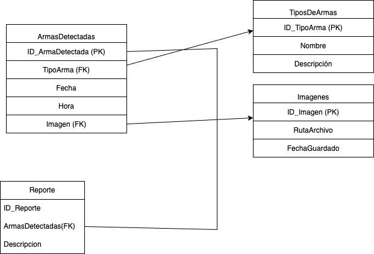

## Diagramas UML del proyecto

### Diagrama de componentes

### Diagrama de clases

### Diagrama de casos de uso

### Diagrama de base de datos

#### Apartado de base de datos
[[Enlace para ir a el apartado de la base de datos]](https://github.com/Dgomez-cpp/DetectorDeArmas/tree/main/BaseDeDatos)
