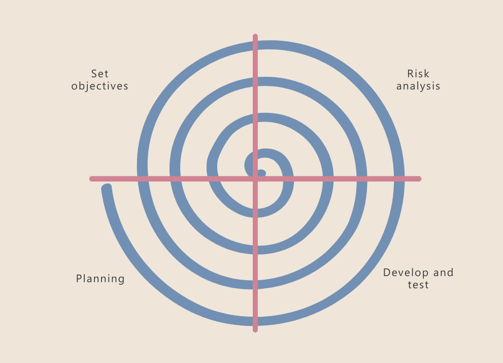

# Detector de Armas en Tiempo Real

## Descripción
Este proyecto implementa un sistema de detección de armas en tiempo real utilizando visión por computadora. Emplea el modelo YOLOv11 (You Only Look Once) para identificar armas, como pistolas, en video capturado desde una webcam. El sistema está diseñado para procesar frames en tiempo real, dibujar bounding boxes alrededor de las armas detectadas y mostrar los resultados en una ventana gráfica. El entrenamiento se realiza con un dataset público de Roboflow, optimizado para la detección de objetos en diversos escenarios.

## Integrantes
- Diego Alonso Gomez Rodriguez - Gerente del proyecto
- Brayan Rayas Andrade - Analista de base de datos
- Daniel Alberto Trasviña Osorio - Desarrollador de software
- Maribel Alba Vargas - Desarrollador de software (Integracion de sistemas y UI)
- Diana Natali Ramirez Jimenez - Diseñador de UX/UI

## Objetivo
El objetivo principal es desarrollar una herramienta capaz de detectar armas de fuego en tiempo real con alta precisión, utilizando una webcam como entrada. Este sistema busca proporcionar una solución práctica para aplicaciones de seguridad, como monitoreo en tiempo real en espacios públicos o privados, con la capacidad de alertar sobre la presencia de armas de manera inmediata.

## Alcance
El proyecto abarca las siguientes funcionalidades:
- Captura de video en tiempo real desde una webcam.
- Detección de armas (enfocada inicialmente en pistolas) utilizando YOLOv11.
- Visualización de resultados con bounding boxes y etiquetas en una interfaz gráfica.
- Entrenamiento del modelo con un dataset público de Roboflow (`weapon-detection-m7qso`).
- Implementación en un entorno local (Mac M Próximos pasos incluyen la integración con sistemas de alerta y la expansión a otros tipos de armas.

Limitaciones actuales:
- Requiere una webcam funcional y un entorno con iluminación adecuada.
- Enfocado en pistolas; la detección de otros tipos de armas depende de la ampliación del dataset.

## Requerimientos Funcionales
1. **Captura de Video**: El sistema debe capturar video en tiempo real desde la webcam del usuario.
2. **Detección de Armas**: Debe identificar la presencia de pistolas en cada frame del video usando YOLOv11.
3. **Visualización**: Mostrar los frames procesados con bounding boxes y etiquetas alrededor de las armas detectadas.
4. **Entrenamiento del Modelo**: Permitir el entrenamiento del modelo con un dataset personalizado para mejorar la precisión.
5. **Cierre del Programa**: El usuario puede cerrar la aplicación presionando la tecla 'q'.

## Requerimientos No Funcionales
1. **Precisión**: El sistema debe alcanzar una precisión mínima del 85% en la detección de pistolas bajo condiciones de iluminación estándar.
2. **Rendimiento**: Procesar al menos 15 frames por segundo en hardware promedio (Mac M1) para garantizar fluidez en tiempo real.
3. **Compatibilidad**: Funcionar en macOS con soporte para Apple Silicon (MPS) y entornos virtuales de Python.
4. **Escalabilidad**: El diseño debe permitir la incorporación de nuevos tipos de armas mediante la ampliación del dataset.
5. **Usabilidad**: Interfaz simple y directa, sin necesidad de configuración compleja para el usuario final.

## Metodología: Modelo en Espiral
El desarrollo del proyecto sigue la metodología en espiral, que combina iteraciones incrementales con la evaluación de riesgos en cada ciclo. A continuación, se describen las fases aplicadas:

### Ciclo 1: Prototipo Inicial
- **Determinación de Objetivos**: Crear un sistema básico de detección en tiempo real con YOLOv11.
- **Análisis de Riesgos**: Evaluación de la disponibilidad del dataset y compatibilidad con Mac M1.
- **Desarrollo**: Implementación de scripts para captura de video (`detect.py`), descarga del dataset (`download_dataset.py`), y entrenamiento básico (`train.py`).
- **Evaluación**: Pruebas locales en la webcam, confirmando la captura y detección inicial de pistolas.

### Ciclo 2: Refinamiento del Modelo
- **Determinación de Objetivos**: Mejorar la precisión del modelo y optimizar el rendimiento.
- **Análisis de Riesgos**: Posible sobreajuste del modelo debido a un dataset limitado; evaluación del rendimiento en tiempo real.
- **Desarrollo**: Ajuste de hiperparámetros en `train.py` y aumento del dataset con técnicas de data augmentation.
- **Evaluación**: Validación con métricas de precisión (mAP) y pruebas de velocidad (FPS).

### Ciclo 3: Escalabilidad y Características Adicionales
- **Determinación de Objetivos**: Ampliar la detección a otros tipos de armas y agregar alertas.
- **Análisis de Riesgos**: Complejidad de integración con sistemas de notificación; necesidad de más datos etiquetados.
- **Desarrollo**: Incorporación de nuevos datasets y desarrollo de un sistema de alertas (pendiente).
- **Evaluación**: Pruebas en escenarios simulados con múltiples tipos de armas.

### Ciclo 4: Despliegue y Mantenimiento
- **Determinación de Objetivos**: Finalizar el sistema para uso práctico y documentar su implementación.
- **Análisis de Riesgos**: Compatibilidad con otros sistemas operativos y hardware.
- **Desarrollo**: Empaquetado del proyecto y creación de documentación detallada.
- **Evaluación**: Pruebas de usuario final y ajustes basados en retroalimentación.

Cada ciclo incluye una iteración de desarrollo, pruebas y retroalimentación, permitiendo mejoras continuas mientras se mitigan riesgos técnicos.

### Diagrama de metodologia de espiral

---

## Diagramas del proyecto

[Apartado de diagramas](https://github.com/Dgomez-cpp/DetectorDeArmas/tree/main/Diagramas)

## Base de datos

[Apartado de base de datos](https://github.com/Dgomez-cpp/DetectorDeArmas/tree/main/BaseDeDatos)

## Instrucciones de Uso
1. Clonar el repositorio: `git clone https://github.com/Dgomez-cpp/DetectorDeArmas.git`
2. Instalar dependencias: `pip install -r requirements.txt` (pendiente de crear).
3. Descargar el dataset: `python Codigo/download_dataset.py`.
4. Entrenar el modelo: `python Codigo/train.py`.
5. Ejecutar la detección: `python Codigo/detect.py`.

## Referencias

- Data set
  [Roboflow (weapon-detection Computer Vision Project)](https://universe.roboflow.com/yolov7test-u13vc/weapon-detection-m7qso)
- Imagen Metodologia de espiral
  [Metodologia de espiral (Imagen)](https://intelequia.com/Portals/0/Blog/Images/modelo%20en%20espiral.jpg?ver=mzH0oeOpJ2T7ug8UglTUEw==)

## Contribuciones
Las contribuciones son bienvenidas. Por favor, abre un issue o envía un pull request con tus mejoras.
