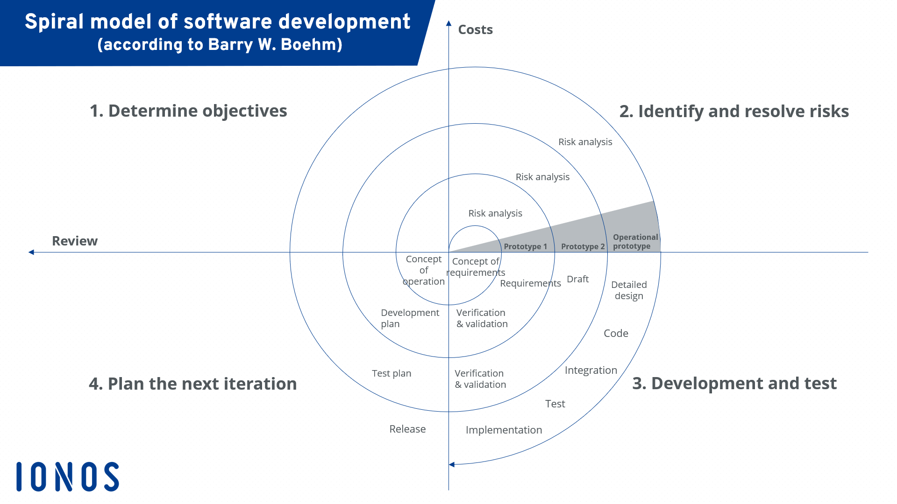

# Sistema de Detección de Armas en Tiempo Real

## Descripción
Se desarrollará un sistema de escritorio innovador que, mediante el uso de la cámara del dispositivo, detectará armas de fuego en tiempo real. Este prototipo está diseñado para mejorar la seguridad en entornos controlados, como oficinas, escuelas y espacios públicos, al proporcionar una herramienta proactiva para la prevención de incidentes violentos.

## Integrantes
- **Diego Alonso Gómez Rodríguez** – Gerente de Proyecto
- **Brayan Rayas Andrade** – Analista de Base de Datos
- **Daniel Alberto Trasviña Osorio** – Desarrollador de Software (Visión por Computadora y Aprendizaje Automático)
- **Maribel Alba Vargas** – Desarrollador de Software (Integración de Sistemas y UI)
- **Diana Natali Ramírez Jiménez** – Diseñador de UX/UI

## Objetivo
Desarrollar un sistema inteligente de detección de armas en tiempo real, utilizando algoritmos de visión por computadora y aprendizaje automático. El sistema se integrará con las cámaras web de una laptop y notificará automáticamente a la computadora cuando el sistema detecte posibles amenazas, con el fin de prevenir incidentes violentos.

## Alcance
Se espera lograr la detección de armas mayor al 50% en un ambiente controlado y emitir una alerta con sonido a las computadoras que integren el software.

## Requerimientos Funcionales
1. **Captura y Procesamiento de Imágenes**: El sistema recibirá video en tiempo real desde la cámara web de la laptop. Se aplicarán técnicas avanzadas de procesamiento de imágenes para mejorar la calidad y facilitar la detección.
2. **Detección Inteligente de Armas**: Se implementarán algoritmos de inteligencia artificial capaces de identificar armas de fuego y armas blancas en imágenes de video. Se emplearán redes neuronales profundas (Deep Learning) para mejorar la precisión en la detección.
3. **Generación de Alertas Automáticas**: Cuando se detecte un arma en una imagen, el sistema enviará una alerta a la computadora en tiempo real. Las alertas incluirán la imagen capturada.
4. **Registro de Eventos y Reportes**: Se almacenará un historial de detecciones con información relevante sobre cada evento y las imágenes detectadas se guardarán en una carpeta local.
5. **Interfaz de Monitoreo**: El sistema contará con un panel de control donde el usuario podrá visualizar las detecciones en tiempo real.

## Requerimientos No Funcionales
1. **Precisión y Fiabilidad**: El sistema deberá detectar armas con un nivel de precisión superior al 50%. Se minimizarán los falsos positivos para evitar alertas innecesarias.
2. **Escalabilidad**: Deberá permitir la conexión de una cámara web de una computadora sin afectar el rendimiento. El prototipo debe funcionar en un espacio controlado.
3. **Seguridad de la Información**: El acceso al sistema deberá estar cifrado para evitar accesos no autorizados. Se implementarán medidas de autenticación para garantizar que solo personal autorizado tenga acceso al sistema, con un log in.
4. **Tiempo de Respuesta**: Desde la detección de un arma hasta la generación de una alerta no deberá pasar mucho tiempo, como máximo no deben pasar 20 minutos. El procesamiento se realizará por medio de frames extraídos de un video.
5. **Compatibilidad**: El sistema deberá ser compatible con formatos de video como MP4 y con una cámara de laptop.
6. **Disponibilidad y Mantenimiento**: Mientras el software esté en ejecución debe funcionar. En caso de algún mantenimiento, el software deberá ser inhabilitado momentáneamente.

## Metodologías de Desarrollo
### Fase 1: Planificación
- Definir los objetivos y alcances del proyecto.
- Identificar los riesgos y desarrollar estrategias para mitigarlos.
- Establecer un plan de trabajo y un cronograma.

### Fase 2: Análisis de Riesgos
- Identificar y analizar los riesgos del proyecto.
- Evaluar la viabilidad del proyecto.
- Desarrollar estrategias para mitigar los riesgos.

### Fase 3: Desarrollo y Prueba
- Desarrollar el software de acuerdo con los requisitos y especificaciones.
- Realizar pruebas unitarias y de integración.
- Realizar pruebas de aceptación.

### Fase 4: Evaluación y Revisión
- Evaluar el software desarrollado.
- Revisar y refinar el software según sea necesario.
- Planificar la siguiente iteración del proyecto.

### Diagrama de metodologia

## Diagramas del proyecto
[[Enlace a diagramas]](./DiagramasUML/ReadmeDiagramas.md)

## Kanban
[Ver Kanban del Proyecto](https://github.com/users/Dgomez-cpp/projects/3)
